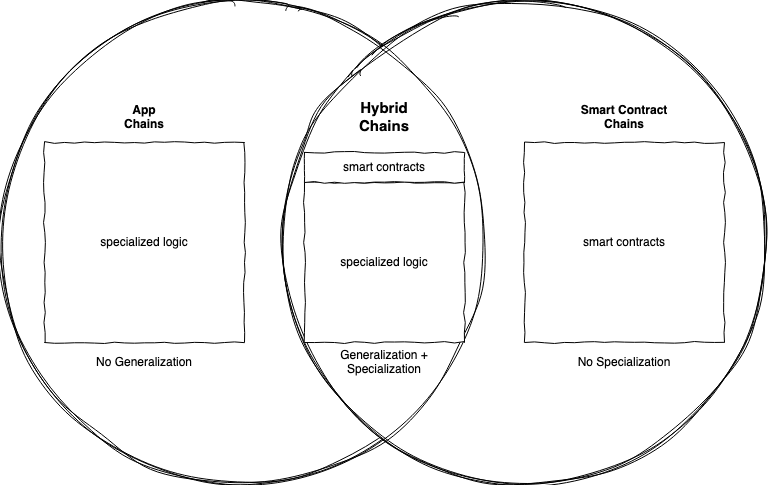

Application-specific blockchains, or app-chains are highly uncontroversial today. The multi-chain ecosystem will evolve such that each chain specializes in one or two specific tasks, which are either user-facing or intermediate products, and applications will be composed of interactions between these chains. It’s the natural conclusion of the multi-chain vision. Right?

To answer this question, we have to dive into the differences between synchronous and asynchronous composability. I define composability here as the ability for two or more programs executed in one or more consensus environments to interface and interact with each other. By programs, I mean things like smart contracts or Substrate pallets or other specialized logic. Those programs are synchronously composed when the results of their interaction can be computed on a single computer without waiting on others. Programs are asynchronously composed when the results of their interaction require input from other computers.

Here’s a rule of thumb for making this a bit more concrete: operations executed within an atomic transaction in a single block are synchronously composed, even if the transaction touches many different components or smart contracts. Operations which touch many blockchains or state machines, even if those chains are under the same shared security umbrella, are asynchronous. These operations require logic to be triggered on other chains before the end result can be seen, and so require waiting on machines which relay and process messages on remote chains.

The properties of synchronous and asynchronous composability are what led us to the app-chain thesis to begin with. The benefit of synchronous composability is tight and fast integration, while the drawback is the scalability limits of a single blockchain. The asynchronous approach lets us split work across many chains and scale further, but introduces expensive round-trips and message passing as a result. We realized we were going to need many chains - whether they were sidechains, parachains, or zones, and that we could further optimize each chain for specialized use-cases, and we could then combine these chains to achieve a more efficient ecosystem.

The flaw in the app-chain thesis is that it neglects the value of synchronous composability and leans entirely into asynchronous composability. We’re entering into new territory, but let’s bring an analogy as a guide. The economy of a single blockchain is to a country’s economy what the multi-chain economy is to international trade. As we have seen in the development of the global economy, countries have specialized in particular fields or areas of economic development. However, even those countries which import cheap goods from countries specialized in manufacturing retain capabilities locally. And vice-versa, there is no country which has specialized entirely into one field, to the extent of not having any other economic activity locally. The same approach is likely to be the most efficient for the multi-chain economy as well: chains will specialize, but not entirely. Chains will benefit most by retaining some generalized capabilities for the benefits of synchronous composability.

Practically, synchronous composability is _instantaneous_. The country analogy breaks down here, because it’s akin to each country having a teleportation service which only works within its own borders. This property implies that no matter how good cross-chain communication gets, the benefits of synchronous composability will never be entirely eroded. Improvements in cross-chain communication will reduce the amount of generalization chains need to retain, but chains will always need to stay slightly generalized to provide the most efficiency. These **hybrid-chains** will allow us to reap the benefits of both. Chain economies will specialize while retaining the generality and opportunity needed for rapid growth of products and communities.

What the hybrid-chain approach is likely to look like in practice is application-specific logic deployed alongside smart contracts, with a limited amount of blockspace allocated to smart contracts. The beauty of embedding smart contracts alongside specialized functionality is that the specialized functionality of a chain can be exposed directly and synchronously to the smart contracts deployed there, giving the smart contracts there an edge or differentiator to smart contracts deployed elsewhere. Given that contracts would only be able to consume some of the resources per-block, the absolute costs of gas would be higher relative to chains that focus entirely on smart contracts, all else equal. But the contracts deployed there would be those that can create the most value from synchronously interacting with the specialized functionality exposed by the chain. Every chain, even app-chains, should have smart contracts.

## Runtime Composition and Innovation Arms

In Polkadot-land, we refer to the ‘business logic’ of the chain as its Runtime. Chains acquire [blockspace](https://www.rob.tech/blog/polkadot-blockspace-over-blockchains/) and the runtime determines how to allocate this blockspace - a raw material derived from decentralized trust. Runtimes written in Substrate are composed of pallets, which each provide functionality such as balance transfers, smart contract logic, or specialized functionality for particular use-cases.

The approach to building a hybrid-chain in a Substrate chain is simple. The first step is to build a runtime composed of pallets, some particular to a use-case, and some generalized pallets for smart contracts. The next step is just to limit the amount of blockspace that all smart contract calls in a block are allowed to use. Substrate’s Weight mechanism makes this totally configurable in the runtime side, by just having the runtime reject transactions over the limit until the next block. Block authors must respect this limit for their block to be valid.

Contract sandboxes can also serve as an innovation and growth engine for an app-chain, particularly those which provide intermediate products meant to be used by user-facing applications. Smart contracts deployed alongside the specialized functionality create a simple on-ramp for developers to utilize it, without having to interface with multiple chains and cross-chain messaging for a first iteration. The iteration speed of developing in smart contracts can be much faster, and these contracts can spin out into a free-standing blockchain once they have the community and user-base to do so. As examples, consider derivatives smart contracts or DAO treasury management living on a chain alongside a DEX pallet, attestation service contracts living next to an identity pallet, or chains deploying "embassy" smart contracts on another chain to manage its affairs there in a synchronous way.

Each app-chain can build out its own innovation hub and onboard developers directly onto the application, lighting a path for them to grow and scale. Substrate pallets are a powerful tool, but their power is enhanced by using them as building-blocks for user-deployed code running in the same synchronous environment. Asynchronous composability lets us scale and expand, and synchronous composability lets us innovate, experiment, and grow.

*Thanks to Björn Wagner and Hernando Castano for discussion and feedback leading to this post*
